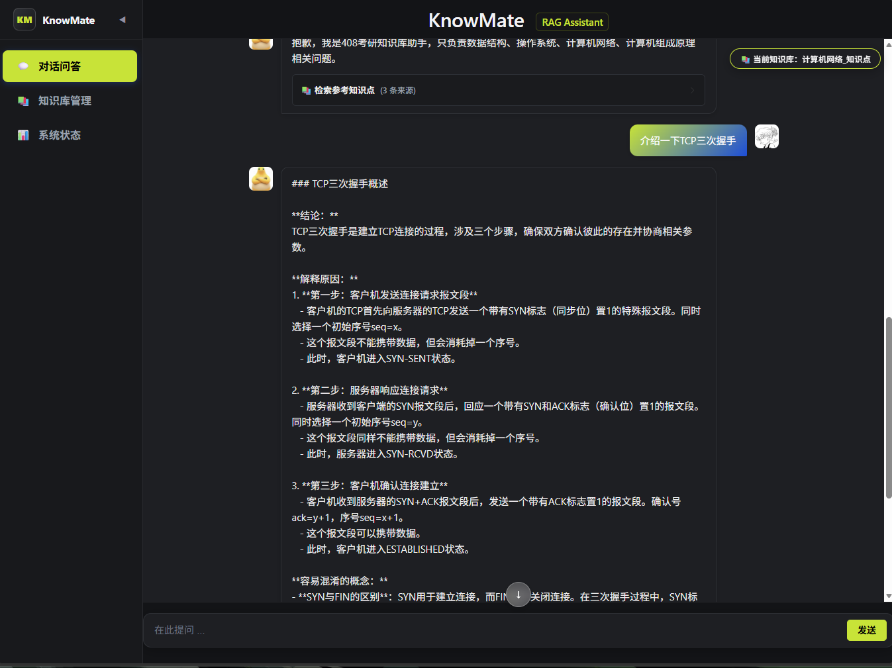
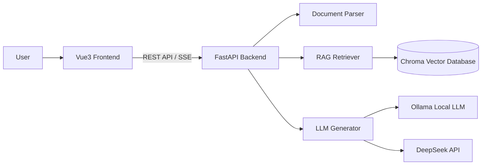

# 🎓 KnowMate-RAG Assistant

> **Local-First 408 RAG Assistant

[](https://www.python.org/downloads/)
[](https://vuejs.org/)
[](https://fastapi.tiangolo.com/)
[]()
[](LICENSE)

---

# 📖 Introduction

**KnowMate** 是一个基于 **RAG（Retrieval-Augmented Generation，检索增强生成）** 架构的 Local-first AI 知识库助手。

当前项目主要面向 **408计算机考研知识学习场景**，通过构建个人知识库，实现对专业教材和学习资料的智能问答。

用户导入或选择408相关资料后，系统通过：

* 📄 文档解析
* ✂️ 知识切片
* 🧠 Embedding向量化
* 🔍 语义检索
* 🤖 大模型生成

实现基于个人学习资料的智能辅导。

当前支持：

* 数据结构
* 计算机组成原理
* 操作系统
* 计算机网络

相比普通 ChatBot，KnowMate 更关注：

* 📚 **基于教材内容回答，降低大模型幻觉**
* 🔍 **回答来源可追溯**
* 🔒 **本地运行，保护个人学习资料**
* 🎯 **针对专业知识场景优化**
* ⚙️ **完整 RAG 应用工程链路**

未来计划支持更多垂直知识库场景，例如：

* 专业课程资料
* 技术文档助手
* 个人知识管理
* 企业内部知识库

---

# ✨ Features

## 🚀 Full-Stack AI Application Architecture

KnowMate 采用前后端分离架构：

```
Vue3 Frontend

        |
        | REST API / SSE Streaming
        |

FastAPI Backend

        |
        |
        ├── Document Parser
        |
        ├── Retriever
        |
        ├── Generator
        |
        └── Vector Database
```

技术特点：

* Vue3 + Element Plus 构建交互界面
* FastAPI 提供高性能 API 服务
* SSE 实现流式回答
* 模块化 RAG 服务设计

---

# 📚 Knowledge Base Management

支持用户构建个人知识库。

当前支持：

* 文本型PDF
* Markdown
* TXT
* DOCX

文档处理流程：

```
Document

↓

Parser

↓

Text Chunking

↓

Embedding

↓

Chroma Vector Database

↓

Retriever

↓

LLM Generation
```

支持：

* 本地知识资料管理
* 多来源文档解析
* 知识库切换
* 基于私有数据问答

---

# 🔍 RAG Pipeline

完整 RAG 流程：

## 1. Document Processing

支持：

* Markdown解析
* TXT解析
* DOCX解析

未来支持：

* 扫描型PDF解析


---

## 2. Text Chunking

采用：

* RecursiveCharacterTextSplitter

根据文本结构切分知识片段。

---

## 3. Embedding

使用：

* BGE-M3 Embedding Model

将文本转换为语义向量。

---

## 4. Vector Retrieval

使用：

* ChromaDB

实现：

* Top-K语义召回
* 私有知识检索

---

## 5. Reranking

支持：

* bge-reranker-v2-m3

用于提升召回结果排序质量。

---

## 6. Generation

支持：

本地模型：

* Ollama
* Qwen2.5
* DeepSeek


---

# ⚡ Streaming Chat Experience

支持类似 ChatGPT 的实时回答体验。

流程：

```
User Query

↓

Knowledge Retrieval

↓

LLM Streaming Generation

↓

SSE

↓

Vue Incremental Rendering
```

特点：

* 打字机效果
* 实时响应
* 更低等待感

---

# 🔒 Local-First Privacy

KnowMate 默认采用本地运行模式。

本地组件：

* Ollama Local LLM
* Local Embedding Model
* Chroma Vector Database

用户资料无需上传第三方平台。

---

# 🏗️ System Architecture



---

# 📂 Project Structure

```
KnowMate-RAG-assistant

├── backend
│   ├── api.py              # FastAPI入口
│   ├── service.py          # RAG业务服务
│   └── schemas.py           # API模型定义
│
├── src
│   ├── parser.py            # 文档解析
│   ├── retriever.py         # 检索逻辑
│   ├── generator.py         # LLM生成
│   └── config.py            # 全局配置
│
├── frontend
│   ├── src
│   │   ├── views
│   │   └── components
│   └── package.json
│
├── data
│   └── knowledge_documents
│
├── vector_db
│
└── README.md
```

---

# 🛠️ Tech Stack

| Layer           | Technology                 |
| --------------- | -------------------------- |
| Frontend        | Vue3 + Vite + Element Plus |
| Backend         | FastAPI + Uvicorn          |
| Communication   | REST API + SSE             |
| RAG Framework   | LangChain                  |
| Vector Database | ChromaDB                   |
| Embedding       | BGE-M3                     |
| Reranker        | BGE Reranker               |
| Local Runtime   | Ollama                     |
| LLM             | Qwen2.5 / DeepSeek         |
| Document Parser | PyMuPDF / python-docx      |

---

# 🚀 Quick Start

## Requirements

* Python 3.11+
* Node.js 18+
* Ollama

---

## Backend

```bash
git clone https://github.com/yourname/KnowMate-RAG-Assistant.git

cd KnowMate-RAG-Assistant

pip install -r requirements.txt
```

启动：

```bash
uvicorn backend.api:app --reload --port 8000
```

---

## Frontend

```bash
cd frontend

npm install

npm run dev
```

---

# 🛣️ Roadmap

## ✅ Completed

* [x] 完成四本408教材清洗，分为知识点 & 题库
* [x] RAG基础问答流程
* [x] Vue3 + FastAPI前后端分离
* [x] SSE流式回答
* [x] Markdown/TXT/DOCX解析
* [x] Chroma向量数据库
* [x] 本地LLM推理
* [x] 知识库切换
* [x] 文档来源引用

---

## 🚧 In Progress

* [ ] 高级检索策略
* [ ] 多文件知识库管理
* [ ] 高级Citation系统
* [ ] 扫描型PDF解析

---

## 🔮 Future

### Advanced RAG

* [ ] Hybrid Search (BM25 + Vector)
* [ ] Better Reranking Strategy
* [ ] RAG Evaluation System
* [ ] Multi-stage Retrieval

### AI Agent

* [ ] Knowledge Agent
* [ ] AI Question Generation
* [ ] Learning Assistant Workflow

### Engineering

* [ ] Docker Deployment
* [ ] One-click Startup
* [ ] Observability System

---

# 🎯 Vision

KnowMate 不只是一个简单的 408 RAG Demo。

未来希望成为一个：

> **面向个人学习、企业知识管理和专业领域场景的 Local-first AI Knowledge Assistant。**

---

# 📄 License

MIT License
