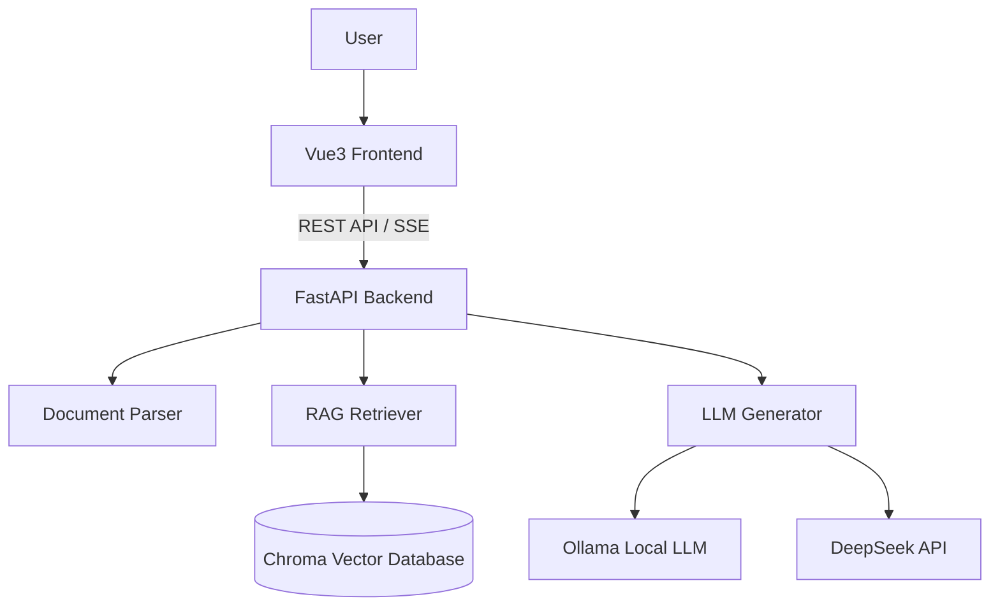
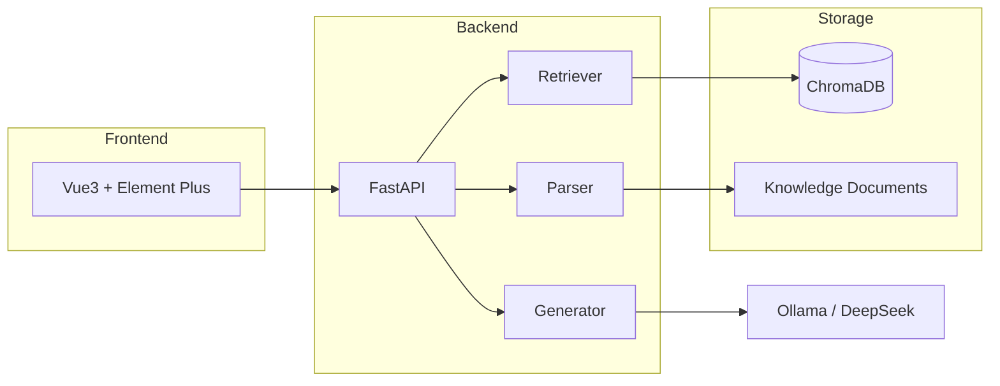

# 🎓 KnowMate-RAG Assistant

> **Local-First Knowledge Base Assistant with Vue3 + FastAPI + RAG**

[](https://www.python.org/downloads/)
[](https://vuejs.org/)
[](https://fastapi.tiangolo.com/)
[](https://www.langchain.com/)
[](LICENSE)

---

## 📖 Overview

**KnowMate** 是一个基于 **RAG（Retrieval-Augmented Generation，检索增强生成）** 的本地知识库助手。

项目采用 **Vue3 + FastAPI 前后端分离架构**，通过文档解析、知识切片、向量检索以及大模型生成，实现基于个人知识库的智能问答。

相比传统 ChatBot，KnowMate 更关注：

- 📚 **知识来源可控**
- 🔒 **数据隐私保护**
- 🎯 **强知识领域精准回答**
- 🚀 **完整 AI 应用工程链路**

当前主要应用场景：

- 408 计算机考研知识库
- 专业课程资料问答
- 个人文档知识管理


---

# ✨ Features

## 🚀 Modern Full-Stack Architecture

采用前后端分离设计：

- Vue3 + Element Plus 前端交互
- FastAPI 后端服务
- REST API + SSE Streaming 通信
- 模块化 RAG 服务层





---

## 📚 Knowledge Base Management

支持用户导入个人知识资料：

- Markdown
- TXT
- DOCX

处理流程：

```
Document
    ↓
Parser
    ↓
Text Chunking
    ↓
Embedding
    ↓
Vector Database
    ↓
Retrieval
    ↓
LLM Answer
```


---

## 🔍 RAG Retrieval Pipeline

当前 RAG 流程：

1. 文档解析

   - PyMuPDF
   - python-docx


2. 文本切片

   - RecursiveCharacterTextSplitter


3. 向量化

   - bge-m3 Embedding


4. 向量检索

   - ChromaDB


5. 可选重排序

   - bge-reranker-v2-m3


6. 大模型生成

   - Qwen2.5
   - DeepSeek


---

## ⚡ Streaming Response

支持类似 ChatGPT 的流式输出：

```
User Query

↓

Retriever

↓

LLM Streaming

↓

Frontend Incremental Rendering
```


通过 SSE(Server-Sent Events) 实现：

- 更低等待感
- 实时生成展示
- 更好的交互体验


---

## 🔒 Local-First Privacy

KnowMate 默认采用本地运行模式：

- 本地 Ollama 推理
- 本地 Embedding
- 本地 Chroma 向量数据库

用户资料无需上传第三方服务。

同时支持：

- DeepSeek API
- 云端模型扩展


---

# 🏗️ Project Architecture





---

# 📂 Project Structure


```
KnowMate-RAG-assistant

├── backend
│   ├── api.py          # FastAPI API
│   ├── service.py      # RAG service layer
│   └── schemas.py      # Request / Response models
│
├── src
│   ├── parser.py       # Document parsing
│   ├── retriever.py    # Vector retrieval
│   ├── generator.py    # LLM generation
│   └── config.py       # Configuration
│
├── frontend
│   ├── src
│   └── package.json
│
├── data
│   └── clean_md
│
├── vector_db
│
└── README.md
```


---

# 🛠️ Tech Stack


| Layer | Technology |
|-|-|
| Frontend | Vue3 + Vite + Element Plus |
| Backend | FastAPI + Uvicorn |
| RAG Framework | LangChain |
| Vector Database | ChromaDB |
| Embedding Model | bge-m3 |
| Reranker | bge-reranker-v2-m3 |
| Local LLM Runtime | Ollama |
| LLM | Qwen2.5 / DeepSeek |
| Document Processing | PyMuPDF / python-docx |


---

# 🚀 Quick Start


## 1. Environment


Requirements:

- Python 3.11+
- Node.js 18+
- Ollama


---

## 2. Install Backend


```bash
git clone https://github.com/yourname/KnowMate-RAG-assistant.git

cd KnowMate-RAG-assistant

pip install -r requirements.txt
```


---

## 3. Prepare Models


```bash
ollama pull qwen2.5:7b

ollama pull bge-m3
```


---

## 4. Start Backend


```bash
uvicorn backend.api:app --reload --port 8000
```


---

## 5. Start Frontend


```bash
cd frontend

npm install

npm run dev
```


---

# 🛣️ Roadmap


## Completed

- [x] Local RAG pipeline
- [x] Markdown/TXT/DOCX parsing
- [x] Chroma vector database
- [x] Knowledge base switching
- [x] FastAPI backend
- [x] Vue3 frontend
- [x] SSE streaming generation
- [x] Document source references


## Future

- [ ] PDF OCR pipeline
- [ ] Hybrid Search (BM25 + Vector)
- [ ] Better reranking strategy
- [ ] Multi knowledge-base management
- [ ] AI question generation
- [ ] Agent workflow exploration


---

# 📄 License

MIT License

##  WORLD PEACE ##