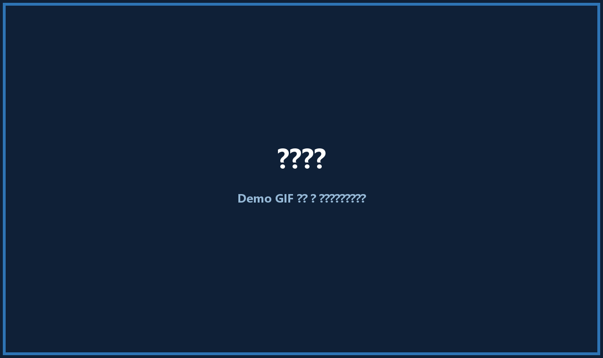
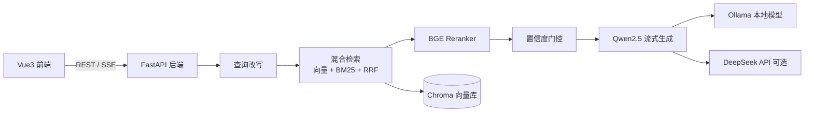
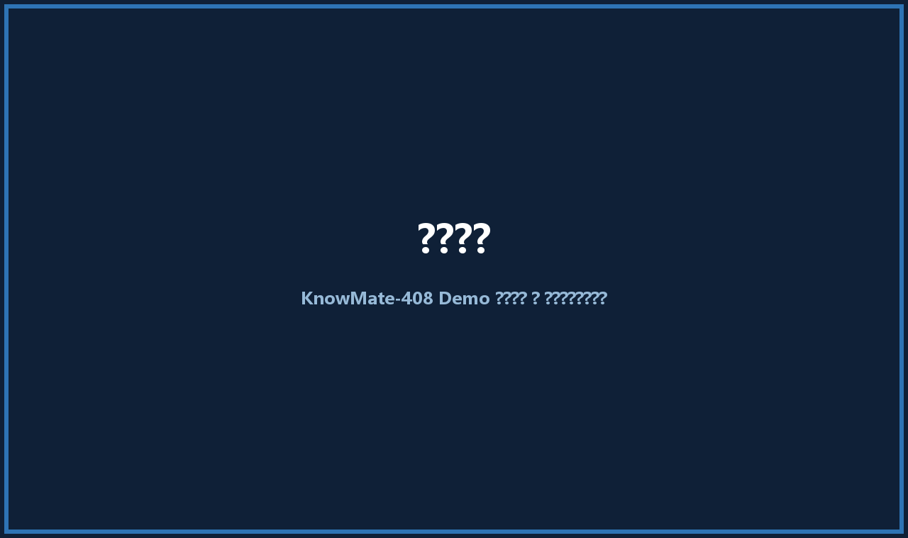
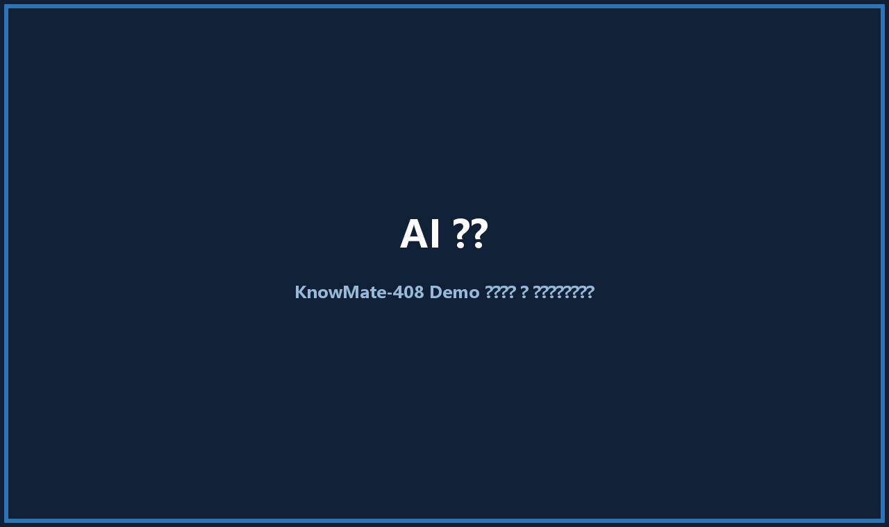

# 🎓 KnowMate-408

> **Local-first 考研智能辅导助手** · RAG 全链路问答 · AI 出题 · 量化评测

[](https://www.python.org/downloads/)
[](https://fastapi.tiangolo.com/)
[](https://vuejs.org/)
[](https://www.docker.com/)
[]()
[](LICENSE)

KnowMate-408 是一个面向计算机考研 **408**（数据结构 / 操作系统 / 组成原理 / 计算机网络）的本地优先智能学习助手：基于个人知识库精准问答、回答可溯源、AI 随机出题即时判题，并自带一套量化评测体系——每一项检索策略选型都由 A/B 实验数据驱动。

**开箱即用：** 克隆仓库 → Docker 一键启动 → 内置四科知识点库与 **1175 道选择题**，无需准备任何数据。



---

## ✨ 功能亮点

| 能力 | 说明 |
| --- | --- |
| 🧠 **RAG 全链路问答** | 查询改写 → 混合检索（向量 + BM25 + RRF）→ 重排 → 置信度门控 → 流式生成 |
| 📌 **回答可溯源** | 行内 `[资料N]` 标注 + 结构化引用（来源 / 页码 / 章节），前端点击定位 |
| 📝 **AI 出题** | 内置四科 1175 道选择题，随机出题 + 即时判题，答案来自题库、秒出 |
| 📄 **扫描型 PDF 识别** | 自动检测图片型文档，提示用户后逐页 OCR 入库（本地离线识别） |
| 📚 **内置知识库** | 四科 408 知识点库，加载即用；支持上传 Markdown / TXT / DOCX / PDF |
| 🖥️ **本地优先** | Ollama + 本地向量库，数据不出机器；可选 DeepSeek 云端模式 |
| ⚡ **流式体验** | SSE 打字机式输出，对话历史持久化 |
| 📊 **量化评测** | 四科 200 题基准、多轮 A/B 对比、一键回归报告 |
| 🐳 **一键部署** | Docker GPU / CPU 双模式，模型自动拉取，服务健康检查 |

## 💎 内置数据资产

- **四科知识点库**：数据结构、操作系统、组成原理、计算机网络，源自四本主流教材的系统化清洗整理，按章节组织、覆盖 408 考纲
- **1175 道选择题题库**：四科全覆盖，答案与解析随题附赠，出题、判题开箱即用
- 全部本地运行，无需联网，克隆即用

## 🤔 为什么选择 KnowMate-408？

| 对比 | 通用 ChatPDF / 纯 LLM | KnowMate-408 |
| --- | --- | --- |
| 回答依据 | 无结构化知识库，易幻觉 | 混合检索 + 重排 + 门控，答案可溯源 |
| 专业适配 | 通用问答，不区分考点 | 针对 408 术语、考纲优化，查询改写专为检索设计 |
| 出题练习 | 无 | 内置千题题库，秒出秒判 |
| 效果验证 | 无评测 | 200 题基准 + 多轮 A/B，选型有数据 |
| 数据隐私 | 依赖云端 | 本地优先，数据不出机器 |

## 🏗️ 系统架构



## 🖼️ 界面预览






## 🛠️ 技术栈

| 层 | 技术 |
| --- | --- |
| 前端 | Vue3 · Vite · Element Plus |
| 后端 | Python · FastAPI · SSE 流式 |
| RAG | LangChain · BGE-M3 向量 + BM25 + RRF 融合 · BGE-Reranker |
| 模型 | Ollama（Qwen2.5-7B / 1.5B / BGE-M3）· DeepSeek API（可选） |
| 存储 | ChromaDB · SQLite |
| 文档解析 | PyMuPDF · python-docx · RapidOCR（扫描件识别） |
| 部署 | Docker Compose（GPU / CPU）· Nginx |

## 🚀 快速开始

### Docker 一键部署（推荐）

**前置条件：** Docker Desktop 已启动；GPU 模式需 NVIDIA 显卡 + 驱动（无显卡请用 CPU 模式）。

```bash
# GPU 模式（默认，推荐）
docker compose up -d --build

# 无显卡 CPU 模式
docker compose -f docker-compose.cpu.yml up -d --build
```

访问：

- 前端：http://localhost:5173
- 后端 API：http://localhost:8000

说明：

- 首次启动自动拉取本地模型（qwen2.5:7b / qwen2.5:1.5b / bge-m3，合计约 6GB）
- reranker 模型目录默认挂载 `D:/models/bge-reranker-v2-m3`，路径不同请修改 `docker-compose.yml`
- 知识库向量库持久化在 `kb_storage` 卷，`docker compose down` 不丢失
- 查看日志：`docker compose logs -f backend`

### 本地开发

```bash
# 后端（需已启动 Ollama）
pip install -r requirements.txt
uvicorn backend.api:app --reload --port 8000

# 前端
cd frontend
npm install
npm run dev
```

本地 Ollama 需已拉取模型：`qwen2.5:7b`、`qwen2.5:1.5b`、`bge-m3`。

### 扫描型 PDF

上传图片型（扫描）PDF 时，系统会检测并提示"识别较慢，推荐使用预设知识点库"；确认后由 RapidOCR 本地逐页识别并入库，识别结果与普通文档一样参与检索。

## 📊 评测结果

内置评测体系：80 题 A/B 基准扩展至四科 200 题基准，裁判为本地模型（temperature=0），指标包括回答质量（1-5）、要点命中率、召回充分性（1-5）。

| 对比项 | 回答质量 | 要点命中 | 召回充分性 |
| --- | --- | --- | --- |
| 纯向量检索 | 3.79 | 0.735 | 4.25 |
| 混合检索（向量 + BM25 + RRF） | **3.99** | **0.821** | **4.66** |
| 混合检索 + 语义切块 | 3.99 | 0.797 | 4.67 |
| 混合检索，关闭 reranker | 3.88 | 0.784 | 4.45 |

关键结论：

- 混合检索四科全胜纯向量；语义切块未胜出，默认采用固定切块 800/150
- reranker + 置信度门控保留：关闭后回答质量明显回落
- 200 题回归已作为后续改动的量化基线（回答质量 3.76 / 要点命中 0.89）

完整对比与复现方式见 [docs/EVAL_REPORT.md](docs/EVAL_REPORT.md)。

## 📂 项目结构

```
backend/          FastAPI 服务（RAG 链路 / AI 出题 / 会话管理）
src/              核心模块（检索 / 生成 / 解析 / OCR / 配置）
frontend/         Vue3 前端（问答 / 知识库 / 出题 / 状态）
data/             内置四科知识点与题库（1175 道选择题）
docker/           Dockerfile 与容器编排
scripts/          评测与工具脚本（回归 / 对比 / 建库 / OCR）
evaluate.py       评测入口
results/          评测结果归档
storage/          向量库持久化（运行时生成）
```

## 🗺️ Roadmap

✅ **已完成**：RAG 全链路、混合检索、引用溯源、AI 出题、扫描型 PDF 识别、评测体系、Docker 部署、一键启动

🚧 **进行中**：演示素材补充（截图 / GIF）、前端Vue,CSS优化

🔮 **规划中**：学习数据分析、Agent 化、评测数据规模

## 📄 License

MIT License
